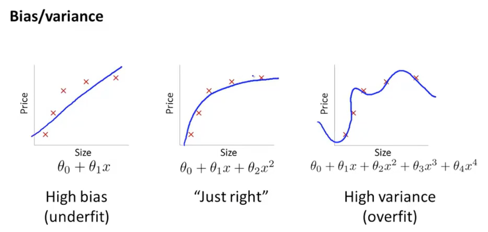
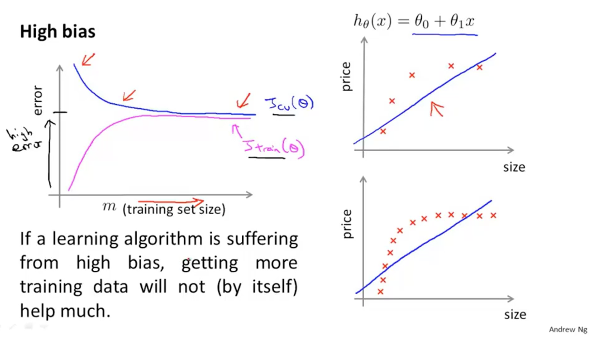
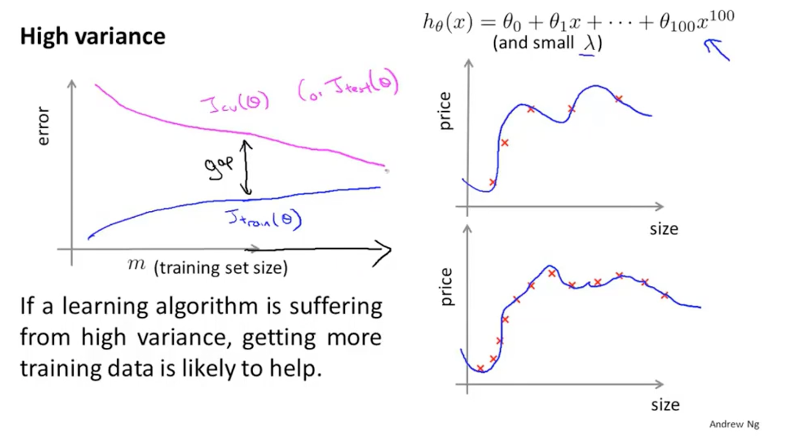
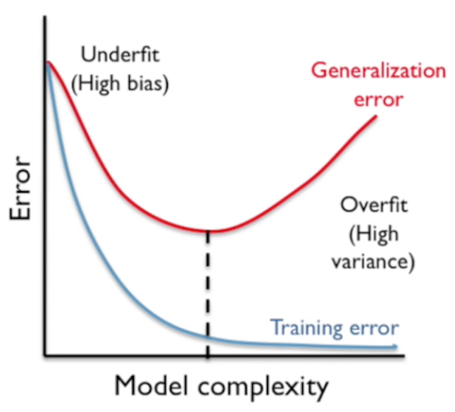

## 欠拟合

欠拟合 (underfitting) 也叫做高偏差 (high-bias) 问题。
模型过于简单，不能很好的拟合问题。

### 特点

train loss 和 test loss 都很大。

### 解决方法

1. 添加更多的特征 (hidden dim 增加)

1. 模型 hidden layer 增多

1. 减少正则化系数

## 过拟合

过拟合 (overfitting) 也叫做高方差 (high-variance) 问题。
当模型有过多参数需要学习时，就可以在 train data 上拟合的更好，而在 test data 上泛化性能很差。

### 特点

train loss 较小而 test loss 很大。

### 解决方法

1. 更多的训练数据

1. 特征选择层面：减少特征种类 (hidden dim 增加)

1. 使用参数正则化 (Regularization)。背后思想：惩罚 (penalty) 模型参数，使得参数更小，参数更小（极限小到 0）时模型就会更简单，模型函数更平滑 (smooth)。

## 早停技术

我们一般将数据集分为：train / valid / test。
train data 用来训练模型，然后在 valid data 上计算 loss，选择 valid data 上 loss 最小的模型作为我们最优的模型 (训练效果好并且泛化性能也高)，并在 test data 上验证性能。

但是随着在 train 的不停迭代过程，可能在 valid 上先后出现好几个差不多比较低的 loss step，此时我们往往第一个 step 下的模型最为最终模型。
这是因为随着训练 epoch 的增加，模型对 train data 的拟合越来越好，对于 test data 的泛化性也会逐步降低。

这种选择技术就是早停 (early stopping)。

