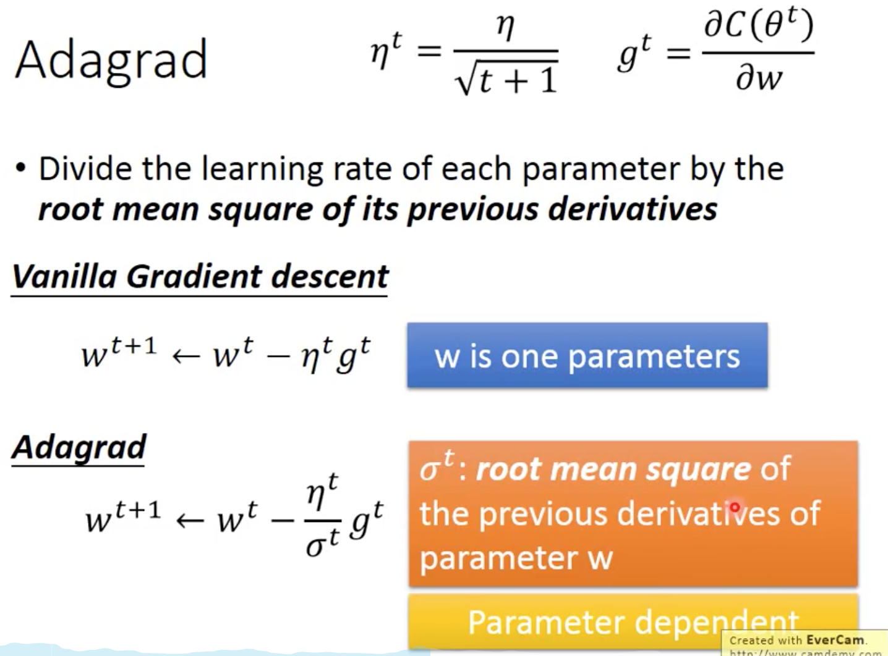
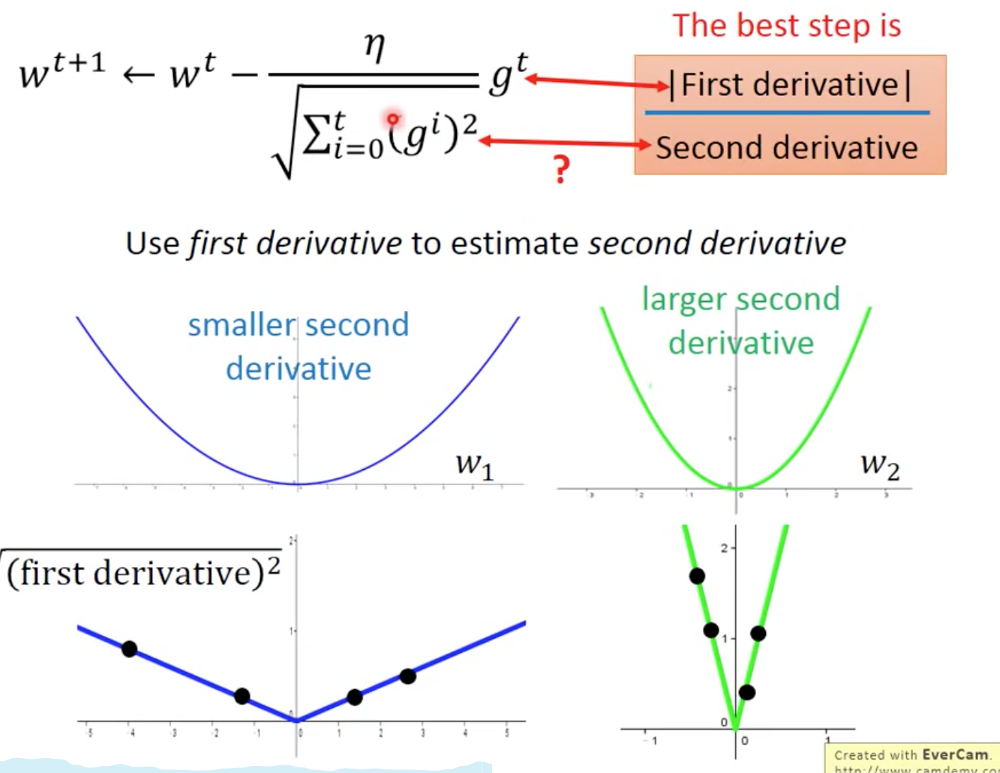

### Adagrad

$$
a^2 + b^2 = c^2
$$

$a^2 = c^2 $

当多参数时，每个参数的应该有不同的更新速率，即不同的学习率。对于每个参数，如果只考虑自身的一阶导来更新自身时，并不能够准确的向最低点更新，需要考虑二阶导的情况。

考虑使用一阶导/二阶导更准确。
Adagrad 考虑使用一阶导估计二阶导。对历史计算得到的一阶导求平方平均值的方式来近似估计二阶导。这种估计成立原因是因为二阶导较大时一阶导也会比较大。

