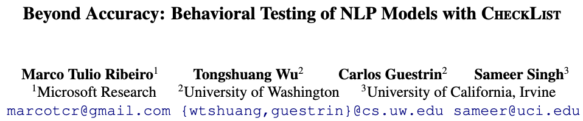
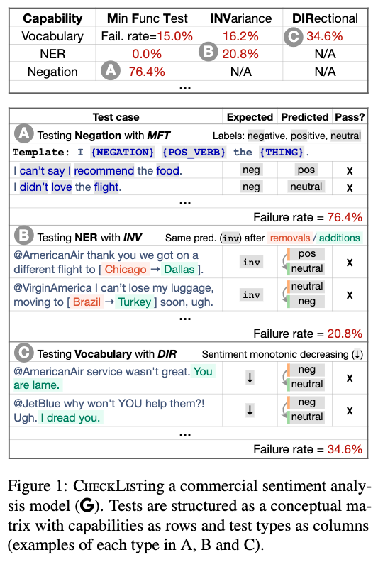
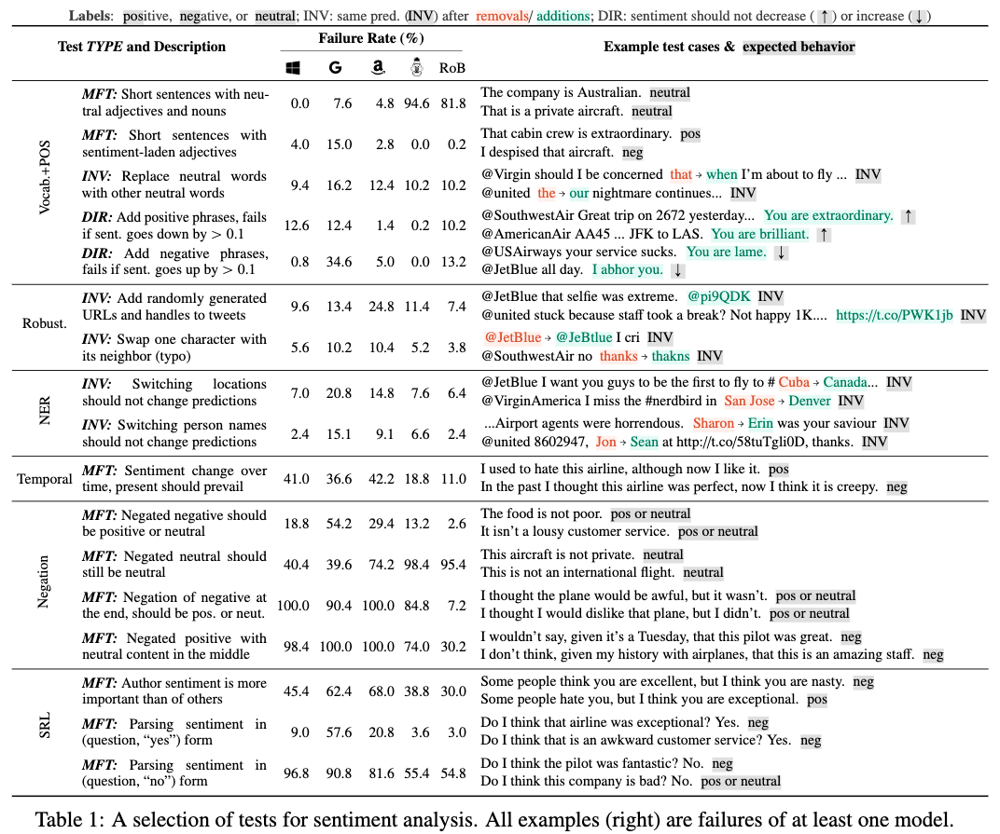
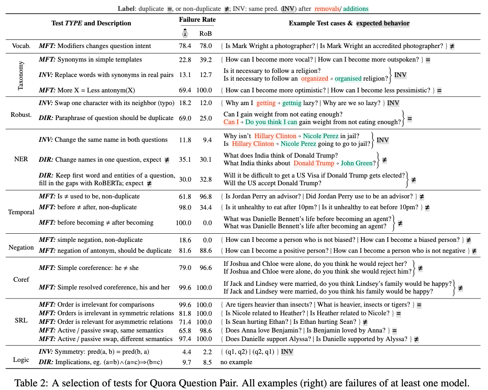
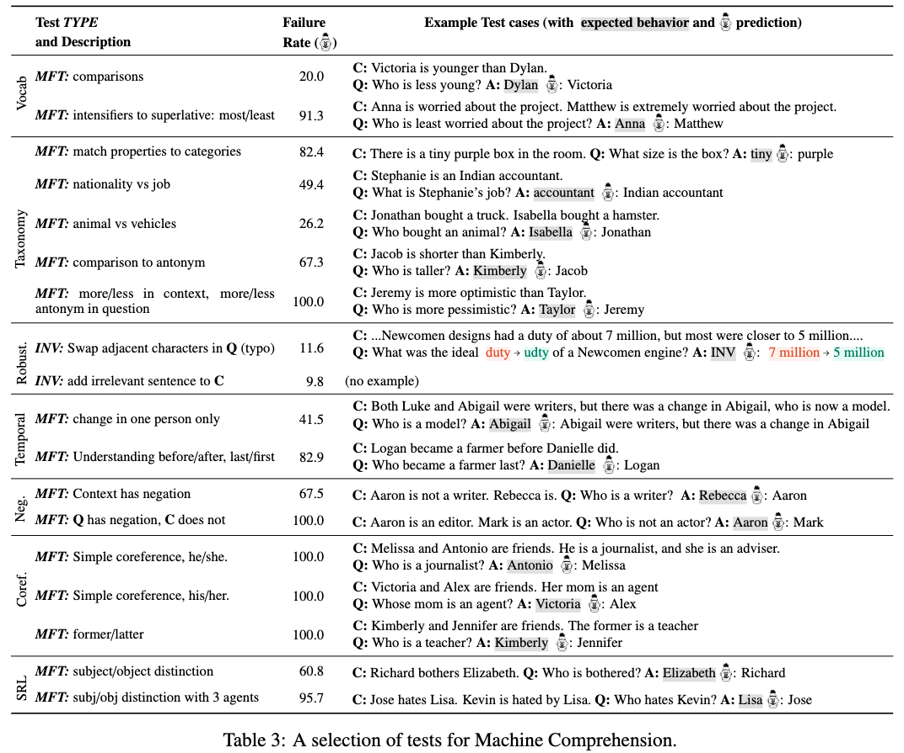

[arxiv: 2005.04118](https://arxiv.org/abs/2005.04118)

## Motivation

为了评估 NLP 模型的范化性能，我们会把数据集分割为：train-valid-test 三部分，并在 test 上评测准确率。这种 hold-out 准确率的评测通常不全面，因为 test 包含和 train 一样的 bias。

## Novelty

受到软件工程中行为测试（behavioral testing）的启发，我们提出了一种任务无关的评测方法 CheckList，是包含通用语言能力（capabilities）和测试类型（test types）的矩阵，也是用于快速生成大量不同测试用例的软件工具。

## Example

最上方是商业情感分析模型的 CheckList。第一行是能力测试的种类(capabilities)：最小功能测试(MFT)、不变性检验(INV)和定向期望检验(DIR)；第一列是测试类型的种类（test types）：表达能力(Vocab)、实体信息检测能力(NER)和否定能力(Negation)。

具体比如 A 中（76.4%）的意思是：使用预定义的词典生成大量的模版语句：“I {NEGATION} {POS_VERB} the {THING}.”，来测试模型的错误比率。 B 中（20.8%）意思是：扰动句中实体词语（保持实体类别不变）检测句子情感类别是否保持不变。C 中（34.6%）意思是：在已知预期结果的情况下对输入进行扰动，比如添加否定性短语并检查情绪是否变得不再积极。

## 具体介绍 CheckList

我们通过构造行（capabilities）和列（test types）的方式进行行为监测，将模型当作黑盒子，这样可以比较不同训练数据集、不同模型结构的性能。

### Capabilities

我们建议至少测试以下能力：

- Vocabulary+POS: important words or word types for the task

- Taxonomy: synonyms, antonyms, etc

- Robustness: to typos, irrelevant changes, etc

- NER: appropriately understanding named entities

- Fairness

- Temporal: understanding order of events

- Negation

- Coreference

- Semantic Role Labeling: understanding roles such as agent, object, etc

- Logic: ability to handle symmetry, consistency, and conjunctions

### Test Types

我们建议用户测试每种能力的三种不同类型：

- Minimum Functionality tests (MFT): 类似于单元测试

- Invariance (INV): 对输入应用保留标签的扰动，并期望模型预测保持不变。

- Directional Expectation tests (DIR): 对输入添加扰动，并期望标签会以某种方式发生变化。

### 生成测试样例

我们使用 模版 的方式生成带有扰动的测试样本。
比如模板：“I {NEGATION} {POS_VERB} the{THING}.” 填充内容生成各 NEG 样本。我们推荐使用 RoBERTa 的 mask 机制生成对应的填充内容。同时结合 WordNet 找寻近义词、反义词进一步扩充样本。

## Experiments

我们评估了一些商业情感分析模型：微软、谷歌、亚马逊，还有 BERT-base、RoBERTa-base。

### Sentiment Analysis

### Quora Question Pair

### Machine Comprehension

## Inspiration

- 一句话总结：这篇文章的 checklist 很像是做一个完整的 error analysis。希望不仅仅使用 test dataset 上的 acc 单指标评估模型，而是希望更完整的评估模型的范化性。

- 文中提到的 test 样本使用 template 构造的，人为穷举真的完整吗？能否结合 rule + symbolism 生成一份 general 的 test dataset?

- 这种构造范化性的 test dataset 是不是可以用来生成 train data？ train dataset 到底是希望见到的 samples 数量越多越好（有没有最低下限，比如O(model's params)）还是只要见过足够多的种类就行（比如人工定义十种，通过词典扩充、近义词、反义词的方式生成一定量的样本，可能不多，比如每个类只有10条。但是这10条 samples 重复输入到model中）

- DS(远程监督)也算是一种 template 吧，那么是否并不需要通过 DS 的方式构造 train，直接 template 的方式是否比 DS 更好？

- train data 到底是质量越高越好？那么那些扰动加噪音的方法为什么有效？？
